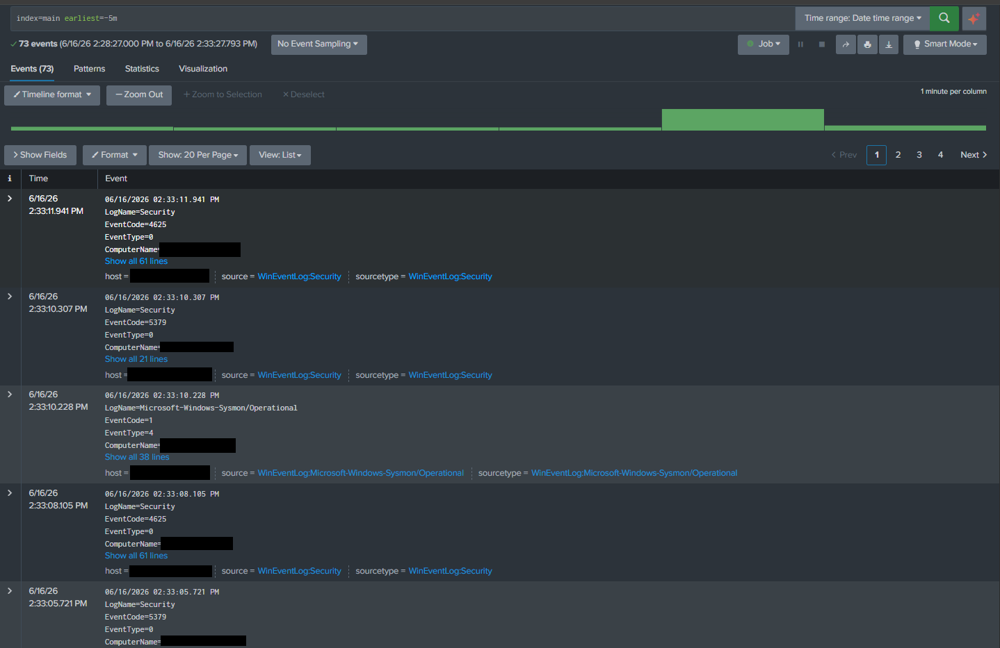
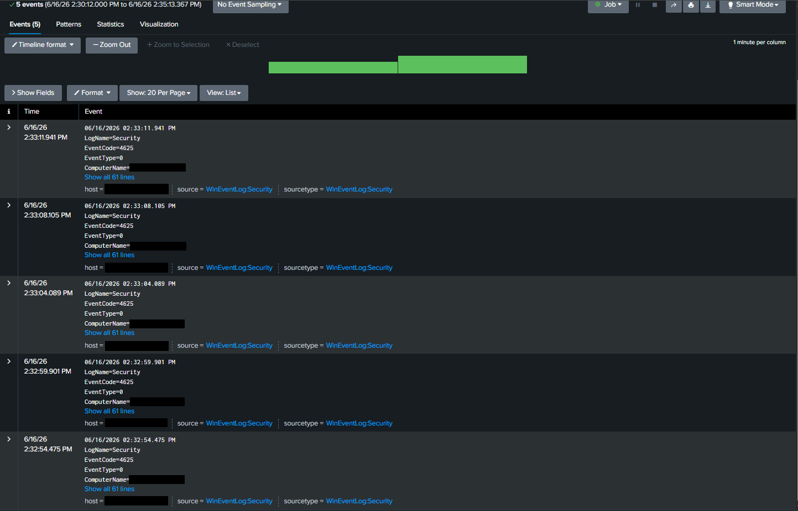
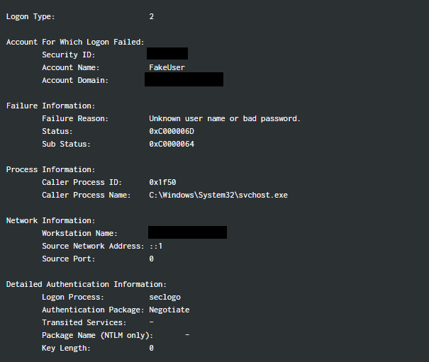
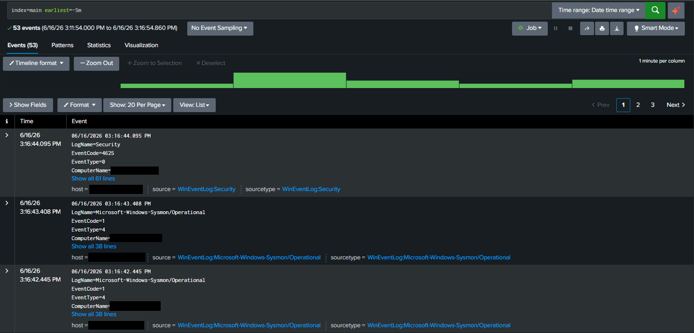
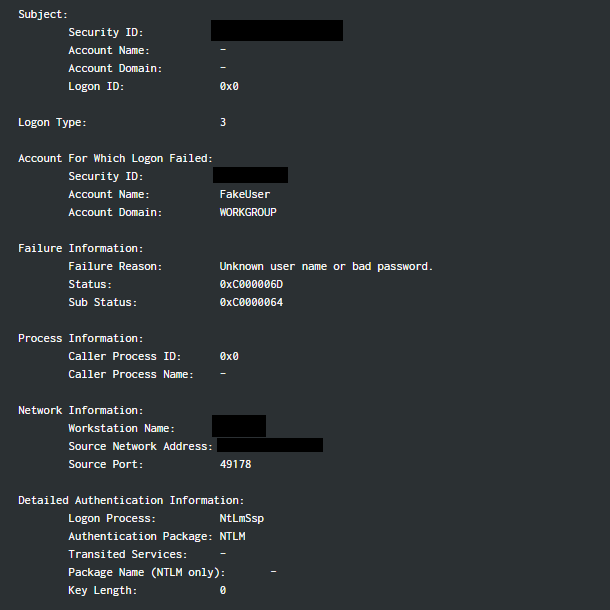

# T1110 - Failed Authentication Investigation

## Objective

Simulate failed authentication attempts originating from local and remote hosts and investigate the resulting Windows Security events using Splunk.

## Attack Scenario

Initially, local authentication failures were generated on the Windows endpoint using invalid credentials. These events appeared as local logon failures and provided a baseline familiarity with Windows Security Event ID 4625.

To simulate a more realistic attack scenario, SMB services were enabled on the Windows endpoint and authentication attempts were performed remotely from a Kali Linux virtual machine using invalid credentials.

The objective was to determine whether the source of the authentication attempt, the target account, and the reason for failure could be reconstructed from Windows Security logs.

## Investigation

### Initial Observation

In both scenarios, reviewing recent events in Splunk revealed multiple Windows Security Event ID 4625 records, or that an account failed to log on.

Several authentication failures were observed within a short period of time, suggesting repeated login attempts against the endpoint.

### Local Authentication Failure Analysis

The first investigation focused on locally generated authentication failures.

Analysis of the events revealed:

* Event ID: 4625
* Logon Type: 2
* Target Account: FakeUser
* Source Network Address: ::1

Logon Type 2 indicated an interactive logon occurring directly on the endpoint, and the source address of ::1 corresponded to localhost, confirming that the authentication attempt originated from the Windows system itself. Further analysis revealed:

* Status: 0xC000006D
* SubStatus: 0xC0000064

Where the substatus code indicated that the specified account did not exist.

This established a baseline for how local authentication failures appear in Windows Security logs, and how to triage them appropriately.

### Remote Authentication Failure Analysis

A second round of authentication attempts on the Windows system was performed via the Kali Linux system.

Unlike the previous events, these new ID 4625 Splunk records contained:

* Logon Type: 3
* Workstation Name: KALI
* Authentication Package: NTLM
* Source Network Address: ATTACKER_HOST

Where Logon Type 3 indicated a network logon attempt, unlike the previous local attempts. The source workstation and source network address identified the Kali system as the origin of the requests.

The remote authentication events targeted the account FakeUser, and Windows rejected each request with:

* Status: 0xC000006D
* SubStatus: 0xC0000064

Where the substatus code, as above, indicates the attempted user account does not exist, categorizing the failure as an invalid username rather than a valid account with an incorrect password.

## Findings

A remote host repeatedly attempted to authenticate to the Windows endpoint using a nonexistent account. Windows rejected the authentication requests and generated Event ID 4625 records containing sufficient information to identify:

* Source host
* Source address
* Target account
* Authentication protocol
* Failure reason

The observed activity aligns with ATT&CK T1110 (Brute Force) and demonstrates how Windows Security logs can be used to attribute failed authentication activity to a specific system.

## Lessons Learned

This investigation demonstrated the differences between local and remote authentication failures. Comparing between Type 2 and Type 3 Logon events allowed practice in understanding determining activity origins, either from the host or elsewhere.

It is also important to verify Windows authentication metadata, such as NTLM authentication and source workstation, to distunguish between invalid usernames or incorrect passwords and, eventually, between username enumeration, password spraying, or user error.

In real environments, firewall policies may significantly influence attack feasibility. Remote authentication attempts from Kali were initally blocked by firewall rules and required explicit enabling to allow SMB accessibility.

Ultimately, when reviewing 4625 events, it is important to review the number of repeated attempts and activity origin to separate brute force attacks from typical users who may have forgotten their password. Real attacks may see significantly more attempts than simulated in this lab.
